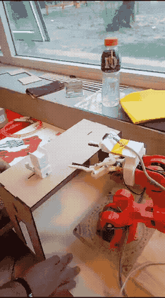
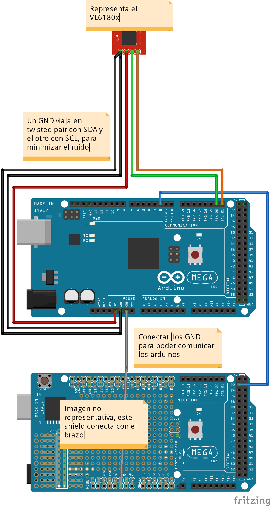

# Brazo con sensor

Es un brazo con un sensor laser de distancia. Permite tomar y soltar cosas desde una repisa.

## Demostración

## Partes

* 2 Arduino Mega: uno controla el brazo, y otro se comunica con el sensor.
* 2 Fuentes 5V: para los Arduinos.
* 1 Sensor VL6180x: mide la distancia entre el brazo y el objetivo.
* 1 Agarre para sensor: ver "AgarreBrazo.stl"
* 1 Brazo Braccio con agarre gripper
* 1 Repisa: donde el robot toma el objeto

## Instrucciones

1. Imprimir el modelo "AgarreBrazo.stl".
2. Instalar "SensorDetect/SensorDetect.ino" en el arduino del laser (puede requerir instalar dependencias).
3. Instalar "CinematicaInversa/CinematicaInversa.ino" en el arduino Mega del brazo (puede requerir instalar dependencias).
4. Conectar como se explica en el diagrama mas abajo
5. Instalar el agarre al brazo y asegurar que mida correctamente (Ver "Calibrar el sensor")

### Calibrar el sensor

Alimentar solo el sensor luego de haberlo colocado en el brazo. La salida de consola serial indica 
rangos sensados o errores. Validar que en el rango correcto, el sensor sense correctamente.

## Notas

### Uso de un ultrasonido

El sensor ultrasonido tiene dos problemas: el angulo de deteccion es muy granade y los falsos positivos son muy altos.
El angulo de deteccion del ultrasonido abarca más que el angulo que puede agarrar el brazo, generando choques entre la
mano y el objeto.  Otro problema es que es muy comun una deteccion cuando no hay ningun objeto. Ambos problemas se 
solucionan con un sensor de distancia laser.

### Uso de dos placas

Por cuestiones de mala calidad de los Arduinos, es critico usar dos placas independientes, comunicadas por un pin. Caso contrario,
el movimiento del brazo genera ruido impredecible en la lectura del sensor, generado errores y falsos negativos. 
